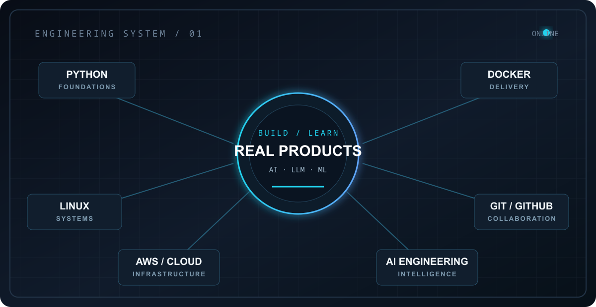

  <table>
    <tr>
      <td align="center" bgcolor="#0D1117">
         
        <h1>AANAA ABDELLA</h1>
        
<strong>SOFTWARE ENGINEER · FULL-STACK DEVELOPER · AI &amp; WEB3 BUILDER</strong>

        

        
<code>&gt;_ building practical software · learning deeply · shipping consistently</code>

         
        
        
        
        
        
          
      </td>
    </tr>
  </table>

---

## About

I'm a software engineering student and developer focused on turning ideas into **practical software products**.

My work spans `Full-Stack Development` · `Web3` · `AI` · `Automation` · `Digital Platforms`, with an emphasis on deliberate learning, practical building, and continuous iteration.

## Portfolio

[🌐 **Explore my portfolio**](https://aana-developer-platform.vercel.app/)

---

## Selected Work

### 🌐 [Web3 Intelligence Platform](https://github.com/Aana-Abdella/web3-intelligence-platform)

A full-stack Web3 intelligence platform for wallet analytics, portfolio visibility, airdrop research, and on-chain data workflows.

**Engineering outcomes**

- **Built:** Next.js frontend, NestJS API, shared TypeScript packages, Prisma/PostgreSQL persistence, and Redis caching.
- **Built:** Wallet search and validation, wallet overview, portfolio data, airdrop eligibility scoring, wallet-auth endpoints, and Swagger API documentation.
- **Built:** Docker Compose infrastructure for the frontend, backend, PostgreSQL, and Redis services.
- **Exploring:** NFT indexing, transaction history, risk analysis, AI wallet insights, notifications, and team workflows.

**Stack:** `Next.js` `NestJS` `TypeScript` `Prisma` `PostgreSQL` `Redis` `Docker` `Viem`

**MVP Progress — 80%**

`████████████████░░░░`

Core platform functionality is documented and implemented; refinement, testing, and additional intelligence modules remain.

[View repository →](https://github.com/Aana-Abdella/web3-intelligence-platform)

---

### 🤖 [AI-Powered Workflow Platform](https://github.com/Aana-Abdella/AI-Powered-Workflow-Automation-Platform)

An AI-assisted workflow platform for process orchestration, webhook-driven automation, and asynchronous task execution.

**Engineering outcomes**

- **Built:** Next.js dashboard with FastAPI services, PostgreSQL persistence, Redis queues, and Celery workers.
- **Built:** JWT authentication, multi-tenant workflow isolation, RBAC, execution logs, usage monitoring, and billing simulation.
- **Built:** Webhook-triggered AI summarization with OpenAI and a fallback summarizer, plus Dockerized local orchestration.
- **Validating:** Integration behavior, deployment configuration, and test coverage across the workflow lifecycle.

**Stack:** `Next.js` `React` `TypeScript` `FastAPI` `PostgreSQL` `Redis` `Celery` `Docker` `OpenAI API`

**MVP Progress — 70%**

`██████████████░░░░░░`

Core workflow execution and AI integration are documented; integration validation and broader testing remain.

[View repository →](https://github.com/Aana-Abdella/AI-Powered-Workflow-Automation-Platform)

---

### 🪂 [Airdrop Intelligence Platform](https://github.com/Aana-Abdella/Airdrop-Intelligence-Platform)

A FastAPI and React workspace for organizing airdrop campaigns, profiles, task progress, evidence, and status workflows.

**Engineering outcomes**

- **Built:** JWT authentication, bcrypt password hashing, user-scoped profiles, and campaign lifecycle states.
- **Built:** Campaign and task tracking, screenshot-backed progress evidence, dashboard summaries, and status notifications.
- **Built:** FastAPI backend, React/Vite frontend, SQLite persistence, documentation, deployment configuration, and test/build commands.
- **Scope:** Wallet fields are metadata; the repository does not claim wallet connection, transaction signing, or guaranteed live multi-chain feeds.

**Stack:** `Python` `FastAPI` `React` `Vite` `SQLite` `JWT` `Docker`

**MVP Progress — 60%**

`████████████░░░░░░░░`

The workflow foundation is documented and implemented; further intelligence, discovery, and operational capabilities remain in development.

[View repository →](https://github.com/Aana-Abdella/Airdrop-Intelligence-Platform)

---

### 🛒 [Ethio Gebeya](https://github.com/Aana-Abdella/Ethio-Gebeya)

A digital commerce platform concept focused on practical multi-vendor e-commerce use cases for the Ethiopian market.

**Engineering outcomes**

- **Designed:** Turborepo structure with Next.js web, NestJS API, and shared Prisma/PostgreSQL database packages.
- **Designed:** JWT authentication, role-based access control, product catalog, seller workflows, checkout, logistics, and audit modules.
- **Planned architecture:** Ethiopian payment integrations with Chapa and Telebirr, order workflows, fleet dispatch, and governance surfaces.
- **Current direction:** Converting the documented platform architecture into focused, testable product increments.

**Stack:** `Next.js` `NestJS` `TypeScript` `Prisma` `PostgreSQL` `Turborepo`

**MVP Progress — 50%**

`██████████░░░░░░░░░░`

The architecture and major platform foundations are documented; feature implementation and validation continue.

[View repository →](https://github.com/Aana-Abdella/Ethio-Gebeya)

---

### MVP Progress Definition

`MVP Progress = completed MVP scope ÷ planned MVP scope × 100`

| Milestone | Definition |
| --- | --- |
| 0–20% | Idea, repository, requirements, and architecture |
| 30–40% | Database foundation, APIs, and business logic |
| 50–60% | Main frontend and frontend-backend integration |
| 70–80% | End-to-end features, testing, validation, and optimization |
| 90–100% | Deployment preparation, security, and planned MVP release |

Progress reflects planned MVP scope, not lines of code or arbitrary activity.

---

## Currently Building

- 🌐 Web3 intelligence and data products
- 🤖 AI-powered workflows and automation
- 🪂 Airdrop intelligence systems
- 🏗️ Digital platforms for practical use cases
- 🐍 Python engineering fundamentals
- 🐧 Linux and systems knowledge

---

## Technology Stack

### Languages

### Frontend

### Backend & Data

### AI · Automation · Web3

`OpenAI` · `Ollama` · `n8n` · `Wagmi` · `Viem` · `AI Systems` · `Workflow Automation`

### Tools & Environment

---

## GitHub Engineering Dashboard

GitHub is where I track the engineering journey through `Repositories` · `Commits` · `Pull Requests` · `Issues` · `Documentation` · `Contribution Activity`.

  

  
  <a href="https://github.com/Aana-Abdella"><strong>Explore GitHub Activity →</strong></a>

---

## Engineering Learning Journeys

I document my learning through structured repositories, practical exercises, experiments, and projects.

### 🐍 Python Engineering

A practical, exercise-first repository for building Python foundations through examples, exercises, notes, and small projects.

**Repository:** [python-learning-journey](https://github.com/Aana-Abdella/python-learning-journey)

| Stage | Focus | Status |
| --- | --- | --- |
| Foundations | Variables, numbers, strings, input, and output | ✅ Documented |
| Control flow | Conditions, decisions, and repetition | ✅ Documented |
| Data structures | Lists, tuples, sets, and dictionaries | ✅ Documented |
| Functions | Parameters, reusable logic, and composition | ✅ Documented |
| Object-oriented Python | Classes, objects, methods, and encapsulation | ✅ Documented |
| Projects | Practical applications and experiments | 🔄 In progress |
| Next steps | Modules, files, exceptions, testing, and algorithms | ⏳ Planned |

→ [View Python Learning Journey](https://github.com/Aana-Abdella/python-learning-journey)

### 🐧 Linux Mastery

A structured systems-learning portfolio covering Linux fundamentals, filesystem management, permissions, processes, shell scripting, networking, security, administration, and automation.

**Repository:** [linux-mastery-journey](https://github.com/Aana-Abdella/linux-mastery-journey)

| Area | Topics | Status |
| --- | --- | --- |
| Fundamentals | Linux basics and command-line practice | Structured |
| Filesystem | Filesystem concepts and navigation | Structured |
| File operations | Working with files and directories | Structured |
| Users and permissions | Users, groups, and permissions | Structured |
| Processes | Process management | Structured |
| Shell and Bash | Shell usage and scripting | Structured |
| Packages and networking | Package workflows and networking | Structured |
| Storage and security | Storage, security, and system practice | Structured |
| Administration and automation | Administration, automation, and final projects | Structured |

→ [View Linux Mastery Journey](https://github.com/Aana-Abdella/linux-mastery-journey)

---

## Current Engineering Focus

<table>
  <tr>
    <td width="33%" valign="top"><strong>🏗️ BUILD</strong>  Full-Stack Products AI Systems Web3 Platforms Automation Tools</td>
    <td width="33%" valign="top"><strong>🧠 LEARN</strong>  Python Linux &amp; Systems Algorithms DevOps &amp; Cloud</td>
    <td width="33%" valign="top"><strong>⚡ IMPROVE</strong>  Architecture Backend Engineering Deployment Engineering Practices</td>
  </tr>
</table>

---

## Engineering Mindset

### Learn → Build → Break → Debug → Improve → Repeat

---

## Connect

---

<strong>Building today. Learning every day. Engineering for tomorrow.</strong>

